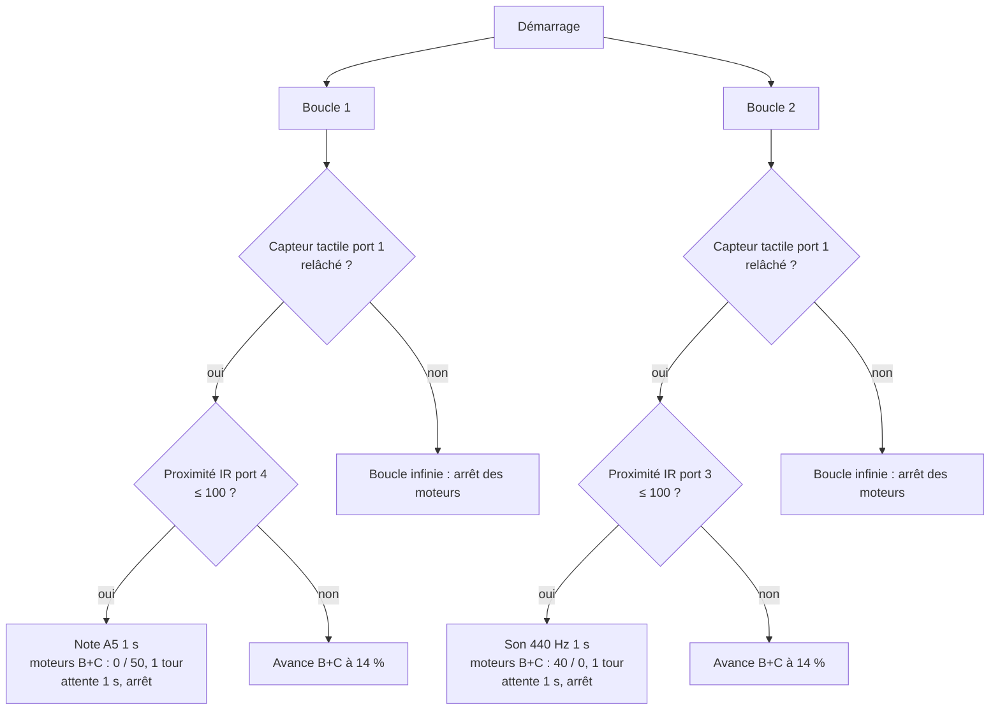

# Escape the Aliens — robot LEGO Mindstorms EV3

## Vue d'ensemble
Programme graphique LEGO Mindstorms EV3 pour un robot mobile à deux moteurs qui avance, évite les obstacles détectés par deux capteurs infrarouges et s'arrête sur appui d'un capteur tactile. Fichier daté de novembre 2024. Contexte (cours, club de robotique, animation) : À documenter.

## Objectifs
- Programmer un comportement d'évitement d'obstacles simple.
- Faire tourner deux tâches en parallèle sur la brique EV3.
- Prévoir un arrêt par capteur tactile.

## Architecture
Le bloc de départ lance **deux boucles infinies en parallèle**, une par capteur infrarouge :



Chaque boucle attend 1 s à la fin de chaque itération.

## Matériel
- Brique LEGO Mindstorms EV3.
- Moteurs sur les ports B et C (pilotage « Move Tank »).
- Capteur tactile sur le port 1.
- Deux capteurs infrarouges sur les ports 3 et 4.

## Logiciel
LEGO Mindstorms EV3 (environnement de programmation par blocs, fichier `.ev3`).

## Implémentation
Paramètres relevés dans `Program.ev3p` (contenu de l'archive `.ev3`) :

| Boucle | Capteur IR | Réaction quand la condition est vraie | Sinon |
|---|---|---|---|
| 1 | port 4 | note A5 (1 s), moteur gauche 0 % / droit 50 % pendant 1 tour → pivot d'un côté | avance à 14 % / 14 % |
| 2 | port 3 | son 440 Hz (1 s), moteur gauche 40 % / droit 0 % pendant 1 tour → pivot de l'autre côté | avance à 14 % / 14 % |

## Principes d'ingénierie
- Programmation multitâche (deux séquences parallèles).
- Évitement réactif : chaque capteur commande un pivot vers le côté opposé.
- Arrêt de sécurité par capteur tactile.

## Résultats
Aucune vidéo ni mesure conservée : À documenter.

## Difficultés / limites (observations sur le fichier)
- Le seuil de proximité est réglé à « ≤ 100 », alors que la proximité infrarouge EV3 varie de 0 à 100 : la condition est donc toujours vraie et le robot pivoterait à chaque itération. Le seuil prévu est à vérifier.
- Les deux boucles commandent les mêmes moteurs (B+C) en parallèle : leurs ordres peuvent se superposer.
- L'environnement EV3 enregistre l'année « 2018 » dans le modèle de projet ; ce n'est pas la date du travail.

## Structure
```
LEGO_EV3_Escape_the_Aliens/
├── README.md
├── .gitignore
└── src/
    └── escape_the_aliens.ev3   (archive du projet : Program.ev3p, Project.lvprojx…)
```

## Exécution
Ouvrir `src/escape_the_aliens.ev3` dans le logiciel LEGO Mindstorms EV3 (ou EV3 Classroom), brancher la brique et télécharger le programme.

## Médias
À documenter (photo du robot, vidéo).

## Compétences
Programmation de robot mobile, capteurs infrarouges et tactile, multitâche, LEGO Mindstorms EV3.
